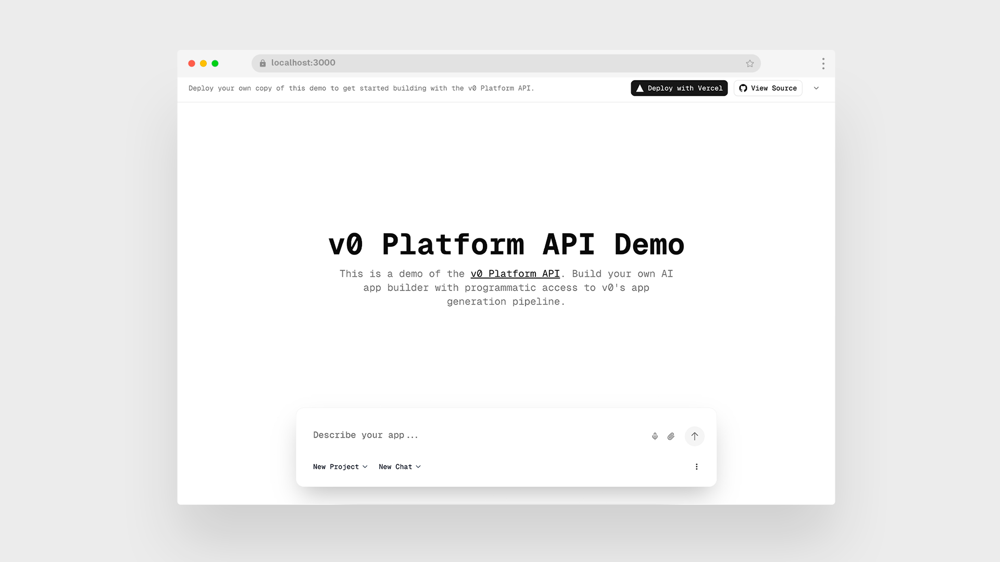

# v0 Platform API Demo

A Next.js application demonstrating the v0 Platform API. Features project management, chat history, and real-time app generation with live previews.



## Setup

1. **Install dependencies:**
   ```bash
   pnpm install
   ```

2. **Configure environment:**
   ```bash
   cp .env.example .env.local
   ```
   
   Add your v0 API key to `.env.local`:
   ```env
   V0_API_KEY=your_api_key_here
   ```
   
   Get your API key from [v0.dev/settings](https://v0.dev/settings)

3. **Run development server:**
   ```bash
   pnpm dev
   ```

## Features

- Project and chat management
- Real-time app generation using v0 Platform API
- Live preview of generated applications
- Session storage for improved performance
- Responsive design with floating prompt interface

## API Routes

- `GET /api/validate` - API key validation
- `GET /api/projects` - List projects
- `GET /api/projects/[id]` - Get project with chats
- `POST /api/generate` - Generate app from prompt
- `GET /api/chats/[id]` - Get chat details
- `DELETE /api/chats/[id]` - Delete chat
- `POST /api/chats/fork` - Fork existing chat

## Tech Stack

- **Framework:** Next.js 15
- **UI:** React 19, Tailwind CSS 4
- **Fonts:** Geist (via next/font/google)
- **API:** v0-sdk
- **Language:** TypeScript

## Project Structure

```
app/
├── api/                  # API routes
├── components/           # Shared components
├── projects/[projectId]/ # Project pages
│   ├── chats/[chatId]/   # Chat pages
│   └── components.tsx    # Project dropdowns
└── globals.css          # Global styles with Geist font
```

## Environment Variables

| Variable | Required | Description |
|----------|----------|-------------|
| `V0_API_KEY` | Yes | Your v0 Platform API key |

## Development

```bash
# Install dependencies
pnpm install

# Run development server
pnpm dev

# Build for production
pnpm build

# Start production server
pnpm start
```
